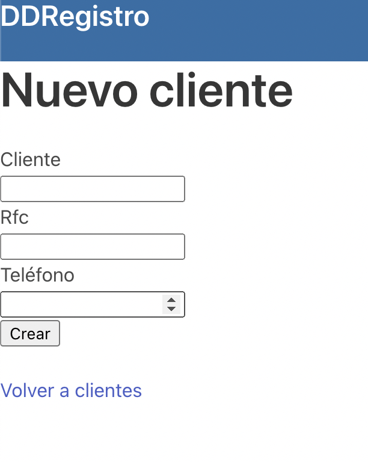
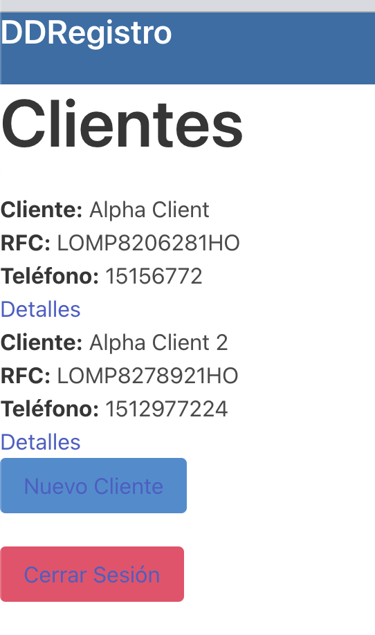
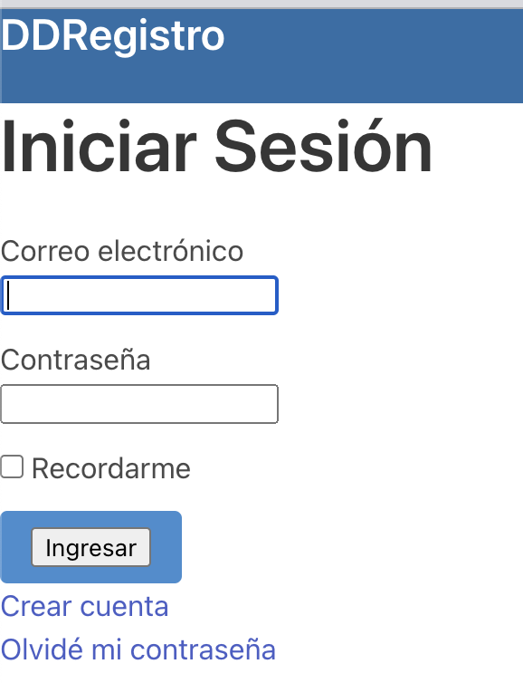

# DDRegistro

> Una plataforma en donde empresas pueden registrar y listar a sus clientes de manera fácil y ordenada (Desarrollada para Take Home Assesment de DD MX).

  
  
  

## Tecnologías

- Ruby
- Ruby on Rails
- MySQL
- Devise
- Bulma (SCSS)

## Inicio

Para obtener una copia de la aplicación solo siga estos pasos:

Ejecutar el comando `git clone` seguido de https://github.com/karelvanoordt/DDRegistro.git

`cd DDRegistro`

### Prerequisitos

Contar localmente con:
- Ruby on Rails
- MySQL
- Un editor de código (IDE) como VSCode o Atom. 

### Configuración

Ejecutar `bundle install` para instalar gemas y dependencias.

Configurar base de datos `rails db:create` y `rails db:migrate`

### Uso

Asegurarse de estar utilizando la rama (branch) `dev`

Ejecutar aplicación con el comando `rails s`

Abrir http://localhost:3000/ en el navegador

## Autor

👤 **Karel van Oordt**

- GitHub: [@karelvanoordt](https://github.com/karelvanoordt)
- Twitter: [@karelvanoordt](https://twitter.com/karelvanoordt)
- LinkedIn: [LinkedIn](https://linkedin.com/in/karelvanoordt)

## 🤝 Contribución

Contribuciones, issues y pedidos de nuevos features son bienvenidos.

Visital la página de [issues](https://github.com/karelvanoordt/DDRegistro/issues/).

## ¡Apoya a un colega!

Dale una ⭐️ si te gusta este proyecto!

## Reconocimientos

- Gracias al equipo de DDMX por la oportunidad de llevar a cabo este assesment.
